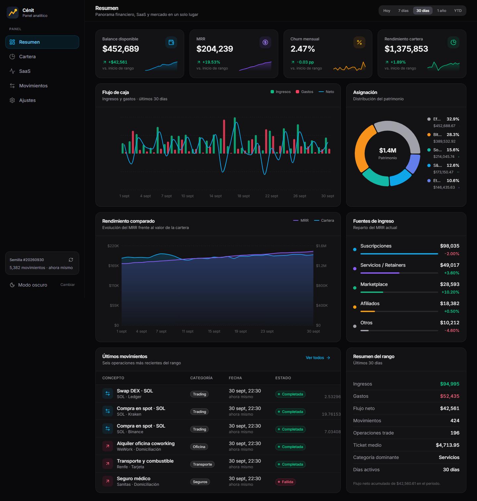
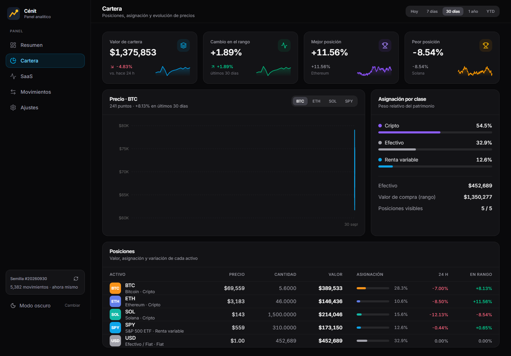
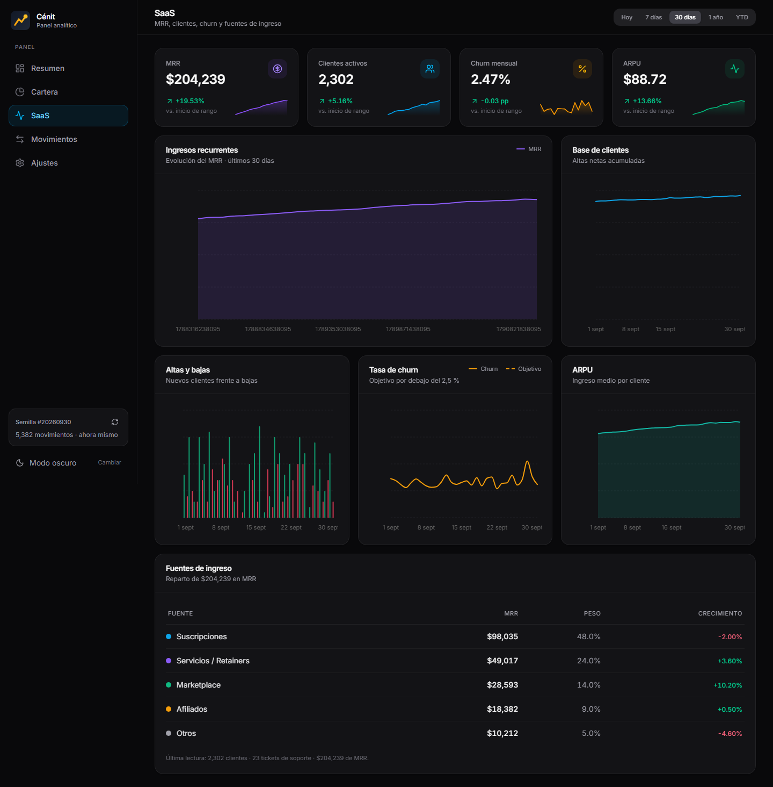
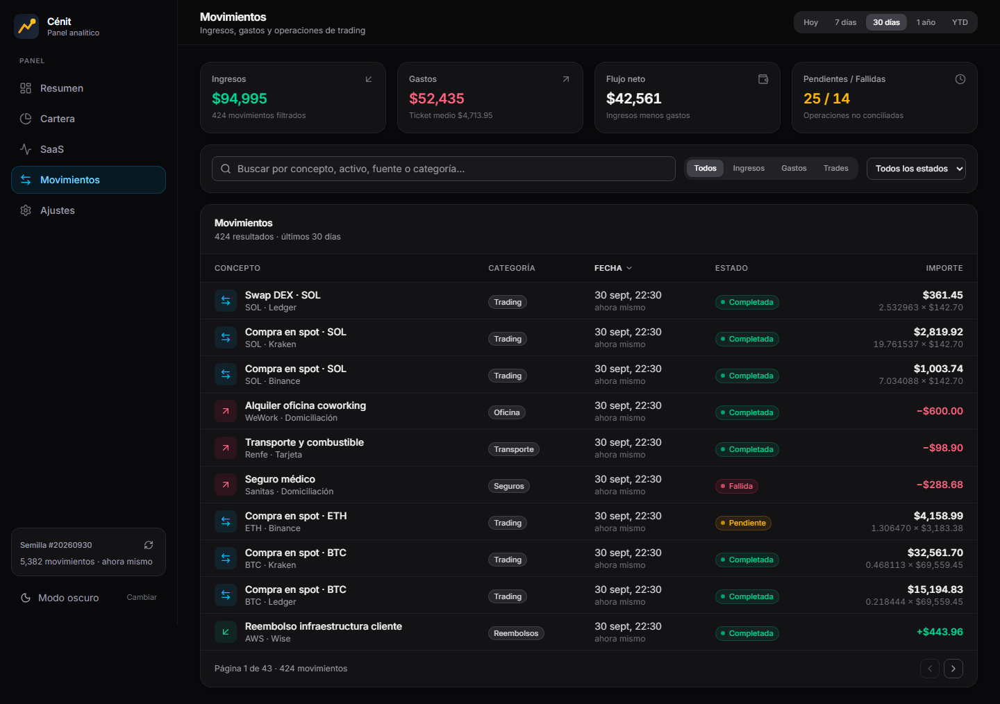
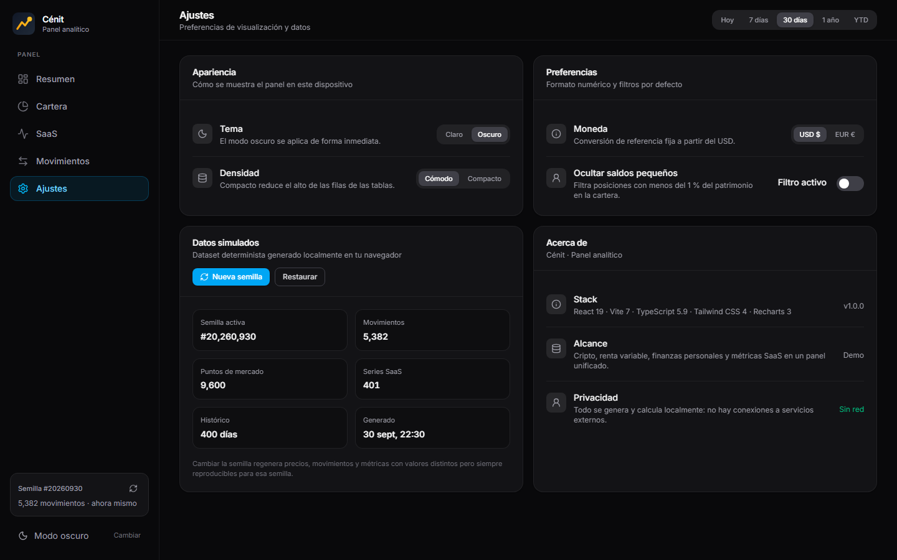
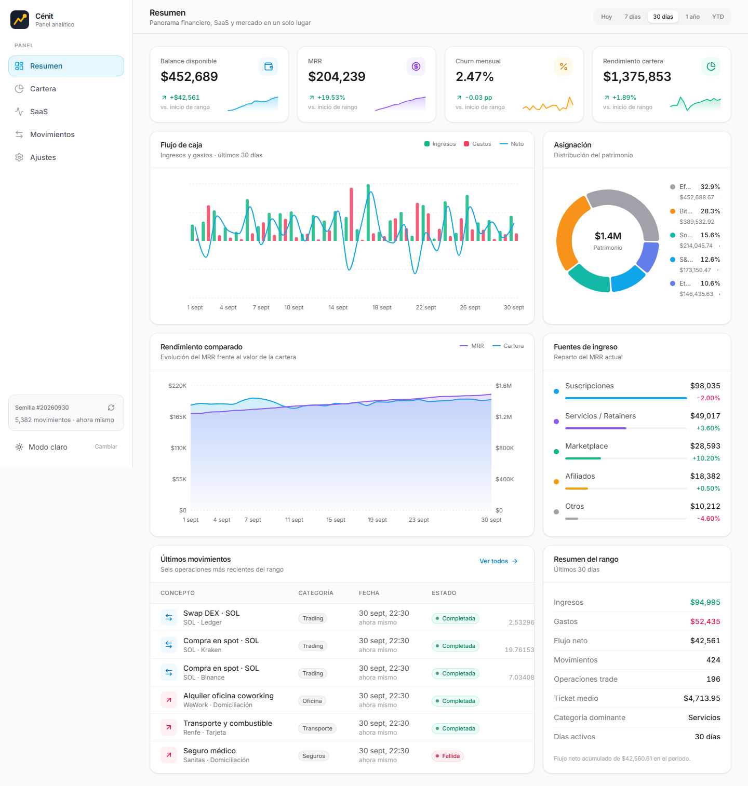
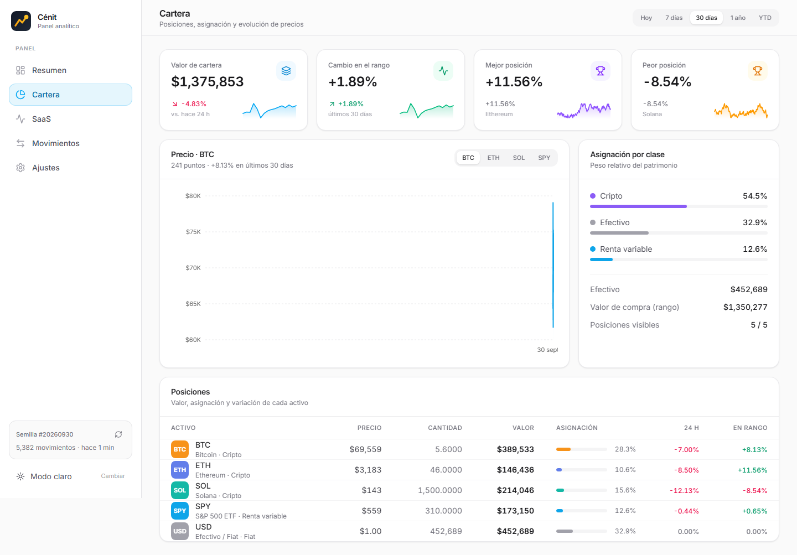
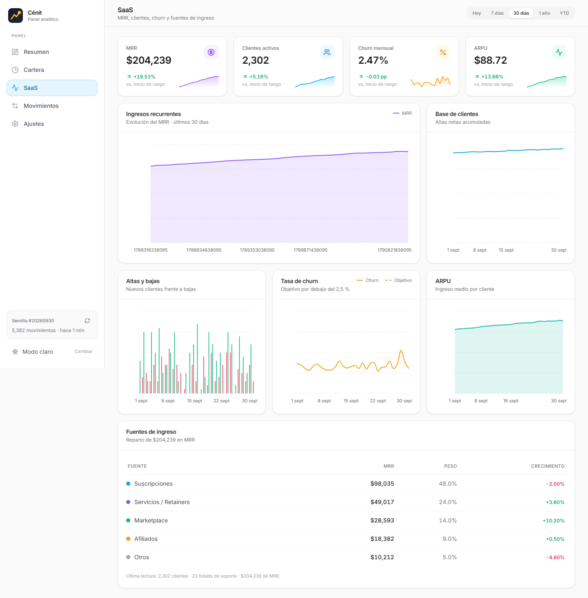
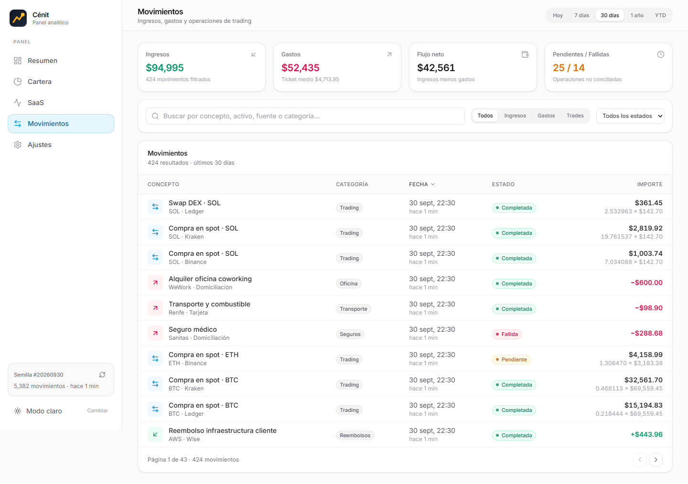
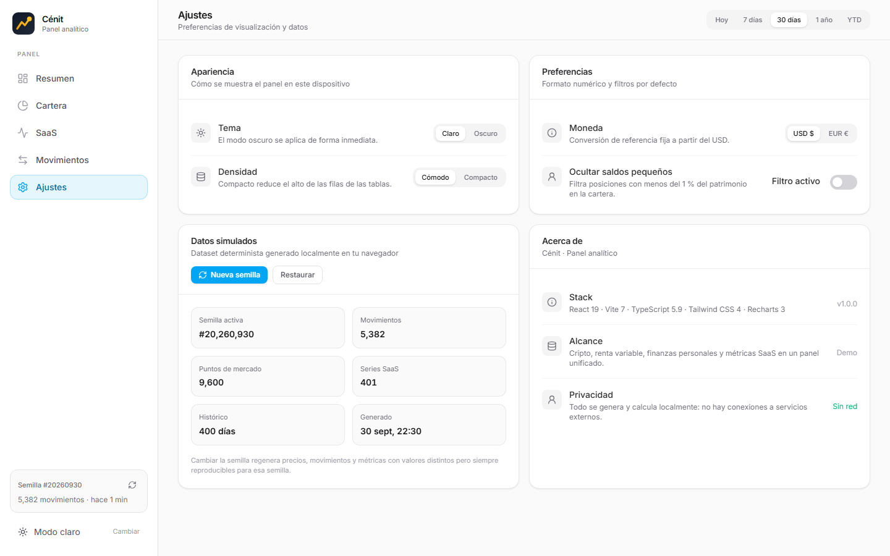

# Cénit

**Panel analítico y financiero** — demo interactiva con un dataset simulado que se genera localmente de forma determinista.

[](https://github.com/pintolj/cen-t/actions/workflows/ci.yml)


**Demo:** https://pintolj.github.io/cen-t/ (publicada automáticamente desde `main` con GitHub Pages)

## Capturas

Tema oscuro:

| Resumen | Cartera |
| --- | --- |
|  |  |

| SaaS | Movimientos |
| --- | --- |
|  |  |

| Ajustes |
| --- |
|  |

Tema claro:

| Resumen | Cartera |
| --- | --- |
|  |  |

| SaaS | Movimientos |
| --- | --- |
|  |  |

| Ajustes |
| --- |
|  |

## Qué es

Cénit reúne en un solo panel finanzas personales, cartera de inversión y métricas de un negocio SaaS: cripto, renta variable y KPIs de suscripción conviven en la misma interfaz, con los mismos controles de rango y tema en todas las vistas.

No hay backend ni servicios externos: todo el dataset se genera en el navegador con un PRNG (`mulberry32`) y una semilla, así que los datos son idénticos en cada carga y puedes regenerarlos desde **Ajustes → Datos simulados**.

## Vistas

| Vista | Contenido |
| --- | --- |
| **Resumen** | Balance disponible, flujo de caja, asignación del patrimonio, rendimiento comparado (MRR vs cartera), fuentes de ingreso y últimos movimientos |
| **Cartera** | Posiciones (BTC, ETH, SOL, SPY), asignación por clase y evolución de precios en el rango |
| **SaaS** | MRR, base de clientes, altas y bajas, tasa de churn, ARPU y fuentes de ingreso |
| **Movimientos** | Ingresos, gastos y operaciones de trading, con filtros por rango, estado, tipo y búsqueda |
| **Ajustes** | Tema claro/oscuro, densidad de tablas, moneda de referencia (USD/EUR), filtro de saldos pequeños y semilla del dataset |

Complementos: selector de rango global (hoy, 7 d, 30 d, 1 a, año en curso), tema claro/oscuro con persistencia, sidebar colapsable en móvil y estados vacíos con acciones de recuperación.

## Stack

- **React 19** + **TypeScript 5.9** (modo `strict`, `exactOptionalPropertyTypes`, `verbatimModuleSyntax`)
- **Vite 7** (build con `manualChunks` para react / charts / icons)
- **Tailwind CSS 4** (tema claro y oscuro, modo `class`)
- **Recharts 3** para gráficos y **lucide-react** para iconos
- Sin librería de componentes ni de estado: UI y contexto propios

## Requisitos

- Node **20.19+** o **22.12+**
- npm 10+

## Desarrollo

```bash
npm install
npm run dev        # http://localhost:5173
```

## Build de producción

```bash
npm run build      # typecheck + vite build -> dist/
npm run preview    # sirve dist/ en local
```

## Verificación

```bash
npm run typecheck   # tsc -b --force
npm run smoke       # renderiza las 5 vistas en Node y valida textos clave, sin NaN/Infinity/undefined
npm run data-check  # coherencia del dataset en los 5 rangos (caja, MRR, cartera, transacciones)
```

Los tres scripts se ejecutan en cada push en GitHub Actions (ver `.github/workflows/ci.yml`).

## Capturas del README

```bash
npm run build   # el script toma dist/ como origen
npm run shots   # Playwright navega las 5 vistas en ambos temas -> docs/screenshots/
```

Requiere `npx playwright install chromium` la primera vez. No forma parte de la CI: se ejecuta en local y las imágenes se versionan en `docs/screenshots/`.

## Estructura

```
src/
├── lib/
│   ├── mock/generator.ts   # dataset determinista (semilla, 400 días de mercado)
│   ├── selectors.ts        # KPIs, series y agregaciones por rango
│   ├── random.ts           # PRNG mulberry32
│   ├── utils.ts            # formato es-ES (moneda, fechas, porcentajes)
│   └── types.ts            # tipos del dominio
├── hooks/useAppState.tsx   # contexto: preferencias, tema, rango, semilla
├── components/
│   ├── brand/  charts/  layout/  tables/  ui/
├── views/                  # Resumen, Cartera, SaaS, Movimientos, Ajustes
└── App.tsx
scripts/
├── smoke.tsx               # SSR de las vistas
├── data-check.ts           # validaciones del dataset
└── screenshot.mjs          # capturas con Playwright (npm run shots)
docs/screenshots/           # imágenes usadas en este README
.github/workflows/ci.yml    # typecheck + smoke + data-check + build + despliegue en Pages
```

## Datos simulados

- Semilla por defecto `20260930`; dataset en caché por semilla.
- 400 días de mercado para BTC, ETH, SOL y SPY; ~5.200 transacciones de ingreso, gasto y trading; serie SaaS diaria (MRR, clientes, churn).
- El balance en efectivo se reconcilia con el flujo neto histórico, y el MRR crece con estacionalidad: los totales coinciden con las series mostradas en las vistas.
- **Todo se calcula en tu navegador**: nada se envía a ningún servicio.
